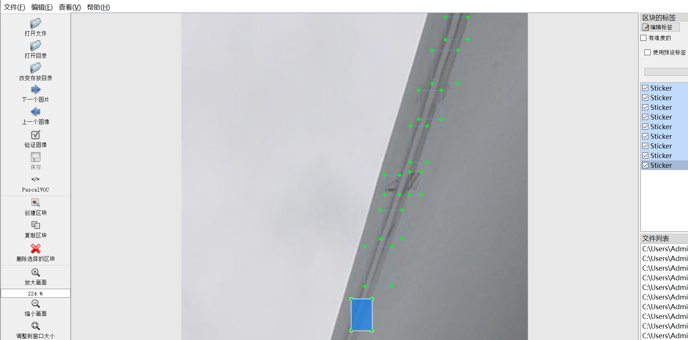
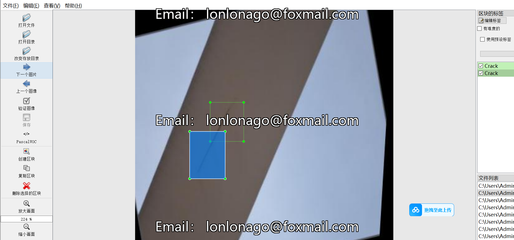
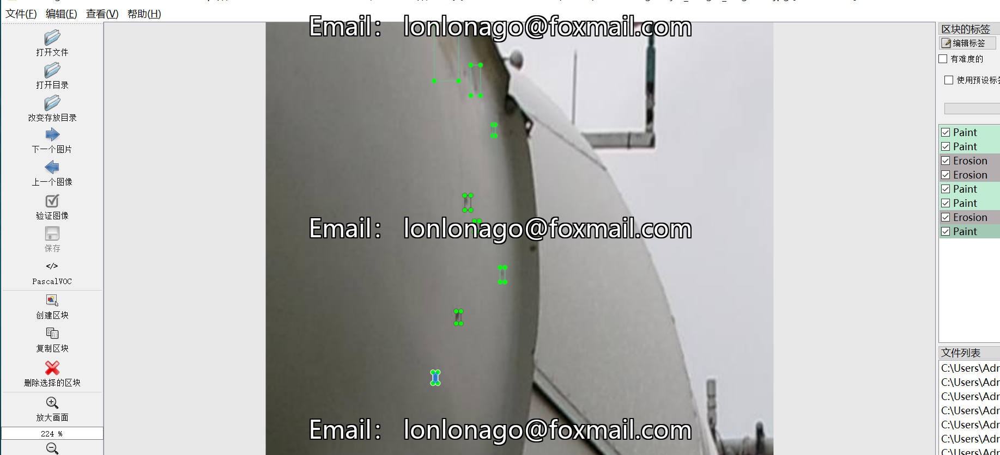

# [Object Detection] Wind Leaf and Damaged turbine Defect Detection Dataset 6-class3884 imagesYOLO+VOC（(Augmented) ）

【Object Detection】Wind Turbine and Turbine Blades Defect Detection Dataset with 6 Classes and 3884 Images (Enhanced by YOLO+VOC)

Dataset Format: VOC format + YOLO format

The compressed file contains: three folders, each storing images, xml files, and text files.

Total jpg images in JPEGImages folder: 3884

The total number of xml files in the Annotations folder is 3884.

The total number of txt files in the labels folder is 3884.

Number of tag types: 6

Tag names: ["Burn Mark","Crack","Erosion","Paint","Sticker","dirt"]

The number of boxes for each label (Note that the order of labels in the Yolo format does not correspond to this, but is based on the classes.txt file in the labels folder):

Burn Mark frame count = 752

Crack frame count = 805

Erosion frame count = 3353

Paint frame count = 4462

Sticker frame count = 704

dirt frame count = 1424

Total boxes: 11500

Picture clarity (Resolution: Pixels): Clear

Image Enhancement: Yes

Shape of the label: Rectangular box, used for object detection and recognition.

Dataset Type ：99m

Special Notice: This dataset does not guarantee the accuracy or precision of the trained models or weight files. The dataset only provides accurate and reasonable annotations.

Annotation example:

## Images

---

Here is a pay link on Stripe (https://buy.stripe.com/3cs8yP7sY87d0vu9AB). Please contact me lonlonago@foxmail.com after funding $89, and I will send you a complete data files, thank you!

